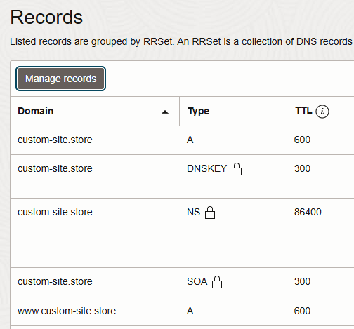
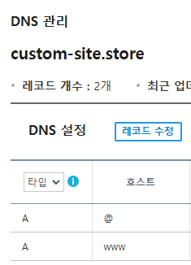

### 가비아 도메인 구매하여 클라우드 퍼블릭 IP 에 연결하는방법

#### 1. 가비아에서 도메인 구매

가비아에서 구매한 도메인은 가비아 등록 도메인으로 네임서버는 구매후 설정하면 된다

#### 2. 오라클 클라우드 DNS 관리에서 ZONE 생성후 네임서버 4개를 가비아에서 도메인 관리에 등록 (가비아 도메인 관리 탭)

ns1.xxxxx.dns.oraclecloud.net

ns2.xxxxx.dns.oraclecloud.net

ns3.xxxxx.dns.oraclecloud.net

ns4.xxxxx.dns.oraclecloud.net

#### 3. 오라클 레코드 등록

A타입 (ipv4)

호스트: (빈값 = @)

호스트: www

값: 퍼블릭 IP

#### 4. 가비아 레코드 등록 (가비아 DNS 관리툴 탭)

A타입 (ipv4)

호스트: @

호스트: www

값: 퍼블릭 IP

