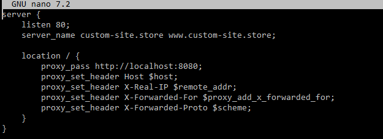

### 엔진엑스 포트포워딩:

#### 8080 포트를 80으로 포워딩해서 포트번호 없이 도메인만으로 연결

Nginx 설치

```bash
sudo apt install nginx
```

Nginx 서비스 시작

```bash
sudo systemctl start nginx
```

시스템 시작 시 Nginx가 자동으로 실행되도록 설정

```bash
sudo systemctl enable nginx
```

Nginx가 8080 포트를 80 포트로 리다이렉트하도록 설정 파일을 수정합니다. 기본적으로 Nginx의 설정 파일은 /etc/nginx/sites-available/default에 있습니다. 이를 열어 설정을 변경합니다

```bash
sudo nano /etc/nginx/sites-available/default
```

설정 파일에서 server 블록을 찾아서 아래와 같이 수정합니다.
이 설정은 Nginx가 80 포트에서 들어오는 요청을 받아 8080 포트로 전달해주도록 설정합니다.

```bash
server {
    listen 80;
    server_name custom-site.store www.custom-site.store;

    location / {
        proxy_pass http://localhost:8080;
        proxy_set_header Host $host;
        proxy_set_header X-Real-IP $remote_addr;
        proxy_set_header X-Forwarded-For $proxy_add_x_forwarded_for;
        proxy_set_header X-Forwarded-Proto $scheme;
    }
}
```



Nginx 설정 파일에 문법 오류가 없는지 확인

```bash
sudo nginx -t
```

문법 오류가 없다면, Nginx를 다시 시작하여 설정

```bash
sudo systemctl restart nginx
```
