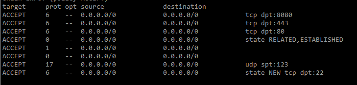

### 오라클 클라우드 경우 인바운드 말고도 방화벽 포트 열어줘야함

방화벽 확인

```bash
sudo iptables -nL
```

chain input 6 라인 (reject all 제거)

```bash
sudo iptables -D INPUT 6
```

http, https, server_port 개방

```bash
sudo iptables -I INPUT -p tcp --dport 80 -j ACCEPT
sudo iptables -I INPUT -p tcp --dport 443 -j ACCEPT
sudo iptables -I INPUT -p tcp --dport 8080 -j ACCEPT
```

저장

```bash
sudo netfilter-persistent save
```

방화벽 결과 확인

```bash
sudo iptables -nL
```


